# Design Document

## Overview

The trading script refactoring will transform a monolithic 3900+ line Python file into a well-organized modular architecture. The design follows the Single Responsibility Principle, separating concerns into distinct modules while maintaining all existing functionality and backward compatibility.

The refactored system will consist of a lightweight main script that orchestrates functionality from specialized modules, each handling a specific domain of the trading system.

**Future-Proofing Considerations:** This design anticipates a future migration from CSV files to a database backend and the addition of a web-based dashboard. The architecture includes data abstraction layers that will facilitate this transition without requiring major structural changes.

## Architecture

### High-Level Architecture

```mermaid
graph TD
    A[trading_script.py - Main Orchestrator] --> B[market_data/]
    A --> C[portfolio/]
    A --> D[financial/]
    A --> E[display/]
    A --> F[utils/]
    A --> G[config/]
    
    B --> B1[data_fetcher.py]
    B --> B2[price_cache.py]
    B --> B3[market_hours.py]
    
    C --> C1[portfolio_manager.py]
    C --> C2[trade_processor.py]
    C --> C3[position_calculator.py]
    
    D --> D1[calculations.py]
    D --> D2[currency_handler.py]
    D --> D3[pnl_calculator.py]
    
    E --> E1[table_formatter.py]
    E --> E2[console_output.py]
    E --> E3[terminal_utils.py]
    
    F --> F1[file_manager.py]
    F --> F2[backup_manager.py]
    F --> F3[timezone_utils.py]
    F --> F4[validation.py]
    
    G --> G1[settings.py]
    G --> G2[constants.py]
```



### Module Organization

The refactored codebase will be organized into the following directory structure:

```
trading_system/
├── trading_script.py              # Main orchestrator (< 500 lines)
├── market_data/
│   ├── __init__.py
│   ├── data_fetcher.py            # Yahoo/Stooq data fetching
│   ├── price_cache.py             # Price caching and fallback logic
│   └── market_hours.py            # Market timing and trading day logic
├── portfolio/
│   ├── __init__.py
│   ├── portfolio_manager.py       # Portfolio CRUD operations
│   ├── trade_processor.py         # Trade execution and logging
│   └── position_calculator.py     # Position sizing and metrics
├── financial/
│   ├── __init__.py
│   ├── calculations.py            # Decimal-based financial calculations
│   ├── currency_handler.py        # Multi-currency support
│   └── pnl_calculator.py          # P&L and performance metrics
├── display/
│   ├── __init__.py
│   ├── table_formatter.py         # Rich/colorama table formatting
│   ├── console_output.py          # Colored output and messaging
│   └── terminal_utils.py          # Terminal detection and sizing
├── data/
│   ├── __init__.py
│   ├── repositories/
│   │   ├── __init__.py
│   │   ├── base_repository.py     # Abstract data access interface
│   │   ├── csv_repository.py      # CSV-based data access (current)
│   │   └── database_repository.py # Database data access (future)
│   ├── models/
│   │   ├── __init__.py
│   │   ├── portfolio.py           # Portfolio data models
│   │   ├── trade.py               # Trade data models
│   │   └── market_data.py         # Market data models
│   └── migrations/
│       ├── __init__.py
│       └── csv_to_db_migrator.py  # Future CSV to DB migration
├── utils/
│   ├── __init__.py
│   ├── backup_manager.py          # Backup and restore functionality
│   ├── timezone_utils.py          # Timezone handling and parsing
│   └── validation.py              # Data validation and integrity checks
└── config/
    ├── __init__.py
    ├── settings.py                # Configuration management
    └── constants.py               # System constants and defaults
```

## Components and Interfaces

### 1. Main Orchestrator (trading_script.py)

**Responsibility:** Entry point, argument parsing, and high-level workflow coordination.

**Key Functions:**
- `main(file_path, data_dir)` - Main execution flow
- Command-line argument parsing
- Module initialization and dependency injection
- Error handling and graceful shutdown

**Dependencies:** All other modules
**Size Target:** < 500 lines

### 2. Market Data Module (market_data/)

#### data_fetcher.py
**Responsibility:** Fetching market data from Yahoo Finance and Stooq with fallback logic.

**Key Classes/Functions:**
- `MarketDataFetcher` - Main data fetching class
- `fetch_price_data(tickers, start_date, end_date)` - Primary data fetching interface
- `_fetch_yahoo_data()` - Yahoo Finance implementation
- `_fetch_stooq_fallback()` - Stooq fallback implementation

#### price_cache.py
**Responsibility:** Caching price data and managing cache invalidation.

**Key Classes/Functions:**
- `PriceCache` - In-memory price caching
- `get_cached_price(ticker, date)` - Cache retrieval
- `cache_price_data(ticker, data)` - Cache storage

#### market_hours.py
**Responsibility:** Market timing, trading days, and business logic.

**Key Functions:**
- `is_market_open()` - Market status checking
- `last_trading_date()` - Trading day calculations
- `trading_day_window()` - Date range calculations

### 3. Portfolio Module (portfolio/)

#### portfolio_manager.py
**Responsibility:** Portfolio data management and persistence.

**Key Classes/Functions:**
- `PortfolioManager` - Main portfolio management class
- `load_portfolio()` - Portfolio data loading
- `save_portfolio()` - Portfolio data persistence
- `update_positions()` - Position updates

#### trade_processor.py
**Responsibility:** Trade execution, validation, and logging.

**Key Classes/Functions:**
- `TradeProcessor` - Trade execution engine
- `execute_trade()` - Trade execution
- `validate_trade()` - Trade validation
- `log_trade()` - Trade logging

#### position_calculator.py
**Responsibility:** Position sizing, metrics, and analytics.

**Key Functions:**
- `calculate_position_size()` - Position sizing logic
- `calculate_portfolio_metrics()` - Portfolio analytics
- `calculate_ownership_percentages()` - Ownership calculations

### 4. Financial Module (financial/)

#### calculations.py
**Responsibility:** Precise financial calculations using Decimal arithmetic.

**Key Functions:**
- `money_to_decimal()` - Decimal conversion
- `calculate_cost_basis()` - Cost basis calculations
- `calculate_position_value()` - Position valuation
- `calculate_pnl()` - P&L calculations

#### currency_handler.py
**Responsibility:** Multi-currency support and exchange rate handling.

**Key Classes/Functions:**
- `CurrencyHandler` - Currency management
- `convert_currency()` - Currency conversion
- `get_exchange_rate()` - Exchange rate retrieval
- `detect_ticker_currency()` - Currency detection

#### pnl_calculator.py
**Responsibility:** P&L calculations and performance metrics.

**Key Functions:**
- `calculate_daily_pnl()` - Daily P&L calculations
- `calculate_total_return()` - Total return metrics
- `calculate_performance_metrics()` - Performance analytics

### 5. Display Module (display/)

#### table_formatter.py
**Responsibility:** Rich table formatting and portfolio display.

**Key Classes/Functions:**
- `TableFormatter` - Table formatting engine
- `create_portfolio_table()` - Portfolio table creation
- `format_money_display()` - Money formatting
- `create_summary_table()` - Summary table creation

#### console_output.py
**Responsibility:** Colored console output and messaging.

**Key Functions:**
- `print_success()`, `print_error()`, `print_warning()`, `print_info()` - Colored output
- `print_header()` - Header formatting
- `display_market_time_header()` - Market time display

#### terminal_utils.py
**Responsibility:** Terminal detection, sizing, and environment handling.

**Key Functions:**
- `detect_terminal_width()` - Terminal width detection
- `detect_environment()` - OS and terminal detection
- `check_table_display_issues()` - Display optimization

### 6. Data Access Module (data/)

#### repositories/base_repository.py
**Responsibility:** Abstract interface for data access operations.

**Key Classes/Functions:**
- `BaseRepository` - Abstract base class for data access
- `get_portfolio_data()` - Abstract portfolio data retrieval
- `save_portfolio_data()` - Abstract portfolio data persistence
- `get_trade_history()` - Abstract trade history retrieval

#### repositories/csv_repository.py
**Responsibility:** CSV-based implementation of data access (current system).

**Key Classes/Functions:**
- `CSVRepository` - CSV-based data access implementation
- `_load_csv_with_timezone()` - CSV loading with timezone handling
- `_save_csv_with_formatting()` - CSV saving with proper formatting
- `_ensure_data_directory()` - Directory management

#### repositories/database_repository.py
**Responsibility:** Database-based implementation of data access (future system).

**Key Classes/Functions:**
- `DatabaseRepository` - Database-based data access implementation
- `_get_connection()` - Database connection management
- `_execute_query()` - Query execution with error handling

#### models/
**Responsibility:** Data models that work with both CSV and database backends.

**Key Classes:**
- `Portfolio`, `Position`, `Trade` - Core data models
- `MarketData`, `CashBalance` - Supporting data models
- Models include serialization/deserialization for both CSV and database formats

### 7. Utils Module (utils/)

#### backup_manager.py
**Responsibility:** Backup and restore functionality (works with any repository type).

**Key Functions:**
- `backup_data()` - Create backups (CSV files or database dumps)
- `restore_from_backup()` - Restore from backup
- `list_backups()` - List available backups
- `export_to_csv()` - Export database data to CSV for backup/migration

#### timezone_utils.py
**Responsibility:** Timezone handling and timestamp parsing.

**Key Functions:**
- `parse_csv_timestamp()` - CSV timestamp parsing
- `format_timestamp_for_csv()` - CSV timestamp formatting
- `get_trading_timezone()` - Trading timezone management

#### validation.py
**Responsibility:** Data validation and integrity checks.

**Key Functions:**
- `validate_portfolio_data()` - Portfolio data validation
- `validate_trade_data()` - Trade data validation
- `check_data_integrity()` - Data integrity checks

### 8. Config Module (config/)

#### settings.py
**Responsibility:** Configuration management and environment settings.

**Key Classes/Functions:**
- `Settings` - Configuration management class
- `load_config()` - Configuration loading
- `get_data_directory()` - Data directory resolution
- `get_repository_type()` - Determine whether to use CSV or database
- `get_database_config()` - Database connection configuration (future)

#### constants.py
**Responsibility:** System constants and default values.

**Key Constants:**
- File paths and names
- Default configuration values
- Market timing constants
- Display formatting constants

## Data Models

### Core Data Structures

The data models are designed to work seamlessly with both CSV and database backends:

```python
@dataclass
class Position:
    ticker: str
    shares: Decimal
    avg_price: Decimal
    current_price: Optional[Decimal] = None
    market_value: Optional[Decimal] = None
    unrealized_pnl: Optional[Decimal] = None
    
    def to_dict(self) -> Dict[str, Any]:
        """Convert to dictionary for CSV/JSON serialization"""
        pass
    
    @classmethod
    def from_dict(cls, data: Dict[str, Any]) -> 'Position':
        """Create from dictionary (CSV row or database record)"""
        pass

@dataclass
class Trade:
    ticker: str
    action: str  # BUY/SELL
    shares: Decimal
    price: Decimal
    timestamp: datetime
    currency: str = "CAD"
    trade_id: Optional[str] = None  # For database primary key
    
    def to_dict(self) -> Dict[str, Any]:
        """Convert to dictionary for CSV/JSON serialization"""
        pass
    
    @classmethod
    def from_dict(cls, data: Dict[str, Any]) -> 'Trade':
        """Create from dictionary (CSV row or database record)"""
        pass

@dataclass
class PortfolioSnapshot:
    positions: List[Position]
    cash_balance: Decimal
    total_value: Decimal
    timestamp: datetime
    snapshot_id: Optional[str] = None  # For database primary key
    
    def to_dict(self) -> Dict[str, Any]:
        """Convert to dictionary for JSON serialization (web API)"""
        pass
```

### Repository Pattern

The repository pattern abstracts data access, making the future database migration seamless:

```python
class BaseRepository(ABC):
    @abstractmethod
    def get_portfolio_data(self, date_range: Optional[Tuple[datetime, datetime]] = None) -> List[PortfolioSnapshot]:
        pass
    
    @abstractmethod
    def save_portfolio_snapshot(self, snapshot: PortfolioSnapshot) -> None:
        pass
    
    @abstractmethod
    def get_trade_history(self, ticker: Optional[str] = None) -> List[Trade]:
        pass
    
    @abstractmethod
    def save_trade(self, trade: Trade) -> None:
        pass
```

## Error Handling

### Error Handling Strategy

1. **Graceful Degradation:** Each module should handle missing dependencies gracefully
2. **Clear Error Messages:** All errors should provide actionable information
3. **Logging:** Comprehensive logging at appropriate levels
4. **Data Protection:** Never corrupt existing data files on errors

### Exception Hierarchy

```python
class TradingSystemError(Exception):
    """Base exception for trading system errors"""
    pass

class MarketDataError(TradingSystemError):
    """Market data fetching errors"""
    pass

class PortfolioError(TradingSystemError):
    """Portfolio management errors"""
    pass

class ValidationError(TradingSystemError):
    """Data validation errors"""
    pass
```

## Testing Strategy

### Unit Testing Approach

1. **Module Isolation:** Each module will have comprehensive unit tests
2. **Mock Dependencies:** External dependencies (Yahoo Finance, file system) will be mocked
3. **Data Validation:** All financial calculations will have precision tests
4. **Edge Cases:** Weekend handling, timezone edge cases, currency conversion edge cases

### Integration Testing

1. **End-to-End Workflows:** Complete trading workflows will be tested
2. **File Compatibility:** Ensure CSV file formats remain compatible
3. **Backward Compatibility:** Existing data files must work with refactored code

### Test Data

1. **Test Data Directory:** Use existing `test_data/` directory for integration tests
2. **Mock Data:** Create comprehensive mock data for unit tests
3. **Edge Case Data:** Create test data for edge cases and error conditions

## Migration Strategy

### Phase 1: Extract Data Models and Repository Layer
- Create data models with serialization support
- Implement BaseRepository abstract interface
- Create CSVRepository as current implementation
- Update main script to use repository pattern

### Phase 2: Extract Utility and Config Modules
- Extract timezone utilities, validation, and backup functions
- Create utils/ and config/ modules with database-aware settings
- Update imports in main script

### Phase 3: Extract Display and Financial Modules
- Extract display formatting and financial calculation functions
- Create display/ and financial/ modules
- Ensure display modules can handle data from any repository type

### Phase 4: Extract Market Data Module
- Extract market data fetching and caching logic
- Create market_data/ module with repository-agnostic caching
- Test data fetching compatibility

### Phase 5: Extract Portfolio Module
- Extract portfolio management and trade processing logic
- Create portfolio/ module using repository pattern
- Test portfolio operations with CSV repository

### Phase 6: Finalize Main Script
- Reduce main script to orchestration logic only
- Implement dependency injection for repository selection
- Complete integration testing

### Future Phase 7: Database Migration (Post-Refactor)
- Implement DatabaseRepository
- Create migration scripts from CSV to database
- Add web API endpoints using existing data models
- Build web-based dashboard consuming the API

## Backward Compatibility

### File Format Compatibility
- All CSV file formats must remain identical during refactoring
- Timestamp formats must be preserved
- Column names and order must be maintained
- CSV files will remain the primary storage during refactoring phase

### API Compatibility
- Command-line arguments must work identically
- Environment variables must be respected
- Configuration files must be compatible
- Future database configuration will be additive, not replacing existing options

### Behavioral Compatibility
- All calculations must produce identical results
- Display output must be visually identical
- Error messages should be consistent or improved

## Future Database Migration Benefits

### Design Decisions Supporting Future Migration

1. **Repository Pattern:** Abstracts data access, making backend swapping seamless
2. **Data Models:** Include both CSV serialization and database-ready fields (IDs, relationships)
3. **Validation Layer:** Centralized validation works with any data source
4. **API-Ready Models:** Data models include JSON serialization for web dashboard
5. **Configuration Management:** Settings system designed to handle multiple backend types
6. **Backup System:** Designed to work with both file-based and database backends

### Web Dashboard Preparation

1. **JSON Serialization:** All data models support JSON output for REST APIs
2. **Modular Display:** Display logic separated from data access for API reuse
3. **Real-time Data:** Market data module designed for both batch and real-time updates
4. **Multi-user Support:** Data models include fields for future multi-user scenarios

### Database Schema Considerations

The data models are designed with future database relationships in mind:

```sql
-- Future database schema (PostgreSQL example)
CREATE TABLE portfolios (
    id UUID PRIMARY KEY,
    timestamp TIMESTAMPTZ NOT NULL,
    total_value DECIMAL(15,2) NOT NULL,
    cash_balance DECIMAL(15,2) NOT NULL
);

CREATE TABLE positions (
    id UUID PRIMARY KEY,
    portfolio_id UUID REFERENCES portfolios(id),
    ticker VARCHAR(10) NOT NULL,
    shares DECIMAL(15,6) NOT NULL,
    avg_price DECIMAL(10,2) NOT NULL,
    current_price DECIMAL(10,2),
    market_value DECIMAL(15,2)
);

CREATE TABLE trades (
    id UUID PRIMARY KEY,
    ticker VARCHAR(10) NOT NULL,
    action VARCHAR(4) NOT NULL CHECK (action IN ('BUY', 'SELL')),
    shares DECIMAL(15,6) NOT NULL,
    price DECIMAL(10,2) NOT NULL,
    timestamp TIMESTAMPTZ NOT NULL,
    currency VARCHAR(3) DEFAULT 'CAD'
);
```